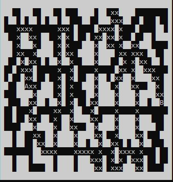

# projektpary

## Kewin Trochowski Oliwer Lisek



## Introduction

Project was written in c++.

The idea of the project was to find a path from point A to point B using adjacency lists and the DFS algorithm.

## Initial Map

The map is created randomly, consisting of 16 segments, which are drawn one by one from the 5 segments created to ensure that the route does not run along the edges of the map.

Then we draw two starting and ending points.

```text
void maps(bool seg_A[5][5], bool seg_B[5][5], bool seg_C[5][5], bool seg_D[5][5], bool seg_E[5][5], bool seg_F[5][5], int map[20][40]) {
	int losowa;
	srand(time(NULL));
	for (int i = 0; i < 4; i++) {
		for (int j = 0; j < 8; j++) {
			losowa = rand() % 6 + 1;
			for (int m = 0; m < 5; m++) {
				for (int n = 0; n < 5; n++) {
					switch (losowa) {
					case 1:
						map[m + i * 5][n + j * 5] = seg_A[m][n]; break;
					case 2:
						map[m + i * 5][n + j * 5] = seg_B[m][n]; break;           
					case 3:
						map[m + i * 5][n + j * 5] = seg_C[m][n]; break;
					case 4:
						map[m + i * 5][n + j * 5] = seg_D[m][n]; break;
					case 5:
						map[m + i * 5][n + j * 5] = seg_E[m][n]; break;
					case 6:
						map[m + i * 5][n + j * 5] = seg_F[m][n]; break;

					}
				}
			}
		}
	}
}

void start(int map[20][40], int& position_r, int& position_c) {
	bool pos = true;
	srand(time(NULL));
	while (pos) {
		position_r = rand() % 20;
		position_c = rand() % 40;
		if (map[position_r][position_c] == 1) {
			map[position_r][position_c] = 2;
			pos = false;
		}
	}                                                         
	pos = true;
	while (pos) {
		position_r = rand() % 20;
		position_c = rand() % 40;
		if (map[position_r][position_c] == 1) {
			map[position_r][position_c] = 3;
			pos = false;
		}
	}

}
```

## Adjacency list

The adjacency function checks whether the free points on which we can move have any neighbors if there are any they are saved as adjacency points.

First checks the point from above then from below , right and left side.

```text
void adjacency(node** list, int map[20][40]) {
	node* beg;
	node* b;

	for (int i = 0; i < 20; i++) {
		for (int j = 0; j < 40; j++) {
			if (map[i][j] >= 2)
			{
				b = new node;
				b->next = NULL;
				if ((map[i][j + 1] >= 2) && (j < 39))
				{
					beg = new node;
					beg->index = map[i][j + 1];
					beg->next = b->next;
					b->next = beg;
				}
				if ((j > 0) && (map[i][j - 1] >= 2))
				{
					beg = new node;
					beg->index = map[i][j - 1];                                         // tworzenie argumentow listy

					beg->next = b->next;
					b->next = beg;
				}
				if ((i > 0) && (map[i - 1][j] >= 2))
				{
					beg = new node;
					beg->index = map[i - 1][j];
					beg->next = b->next;
					b->next = beg;
				}
				if ((map[i + 1][j] >= 2) && (i < 19))
				{
					beg = new node;
					beg->index = map[i + 1][j];
					beg->next = b->next;
					b->next = beg;
				}
				list[map[i][j] - 2] = b;
			}
		}
	}
}
```

## DFS algorithm

Here we are looking for a path between two points. The algorithm uses a list of neighbors and checking if the adjacent point has been visited. If so it is saved and the algorithm moves on. The algorithm runs until it finds the end point.

```text
int DFS(node** list, int map[20][40], int nr = 2) {
	node* beg;
	beg = list[nr - 2];
	beg->visited = true;

	if (nr == 3) {
		return 1;
	}

	while (beg) {
		if (list[beg->index - 2]->visited != true) {   // sprawdzenie odwiedzenia
			nr = beg->index;
			if (DFS(list, map, nr) == 1) {
				if (nr != 3)
					for (int i = 0; i < 20; i++)
						for (int j = 0; j < 40; j++)  // tworzenie drogi AB
							if (map[i][j] == nr)
								map[i][j] = 1;

				return 1;
			}
		}
		else beg = beg->next;
	}
	return 0;
}
```